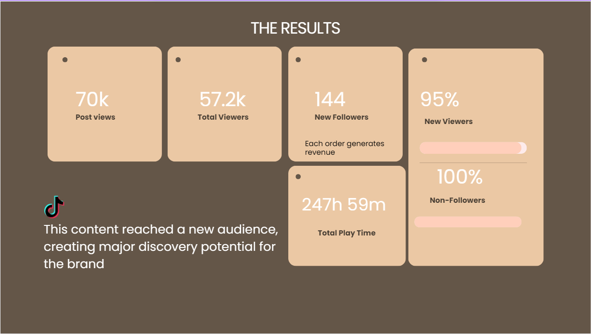

## PORTFOLIO

Brianna Williams

Public relations and Marketing Specialist
I have a Bachelor’s degree in Public Relations and an associate degree in Marketing. I have also built hands-on experience in the hospitality industry as a Front Desk Agent, where I have developed strong skills in customer relations, sales support, lead generation, and business development.

Bachelor of Arts, Public Relations
California State University· 2021

Skills
Strategic Communication, Media Relations, Brand Storytelling, Event Planning, Public Relations, Lead Generation, Sales Support
Client Relations, Copywriting, Social Media Strategy, CRM Management, Proposal Writing, Event Coordination, Market Research

Case Study
Covara Beauty
Covara Beauty needed to reach potential consumers beyond its existing audience. The campaign needed to feel useful, affordable, and relatable—not like a traditional product advertisement.

The idea was to meet people where they already discover beauty: TikTok—and make the content feel accessible, relatable, and genuinely useful.

Hospitality Sales
Research and qualify prospective corporate, group, and event clients to build a consistent sales pipeline.
Maintain CRM accuracy and reporting so leadership has a clear view of pipeline health.
